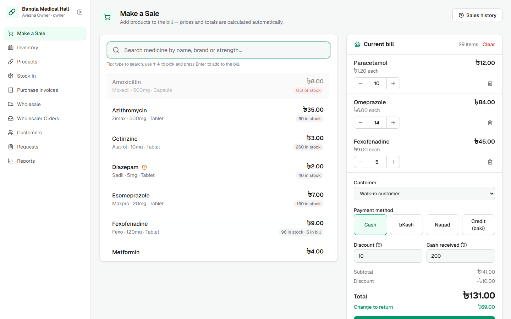
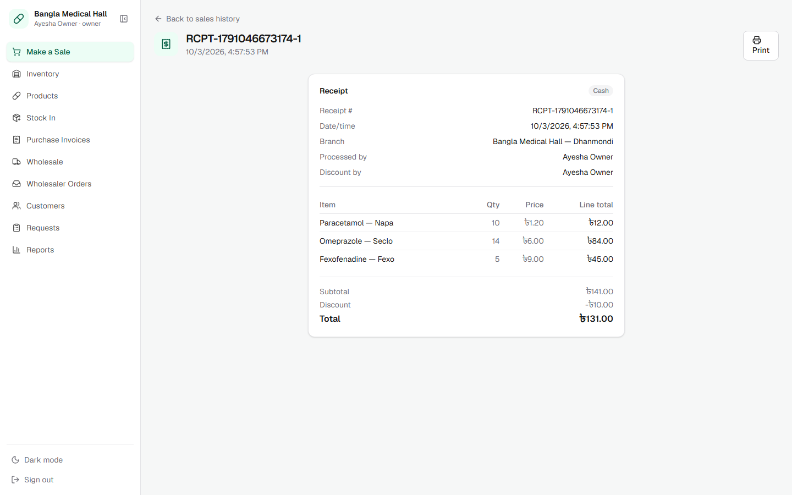
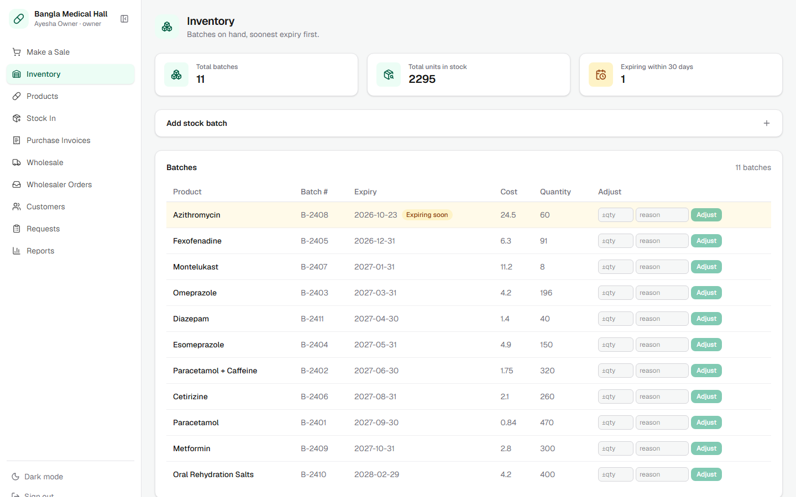
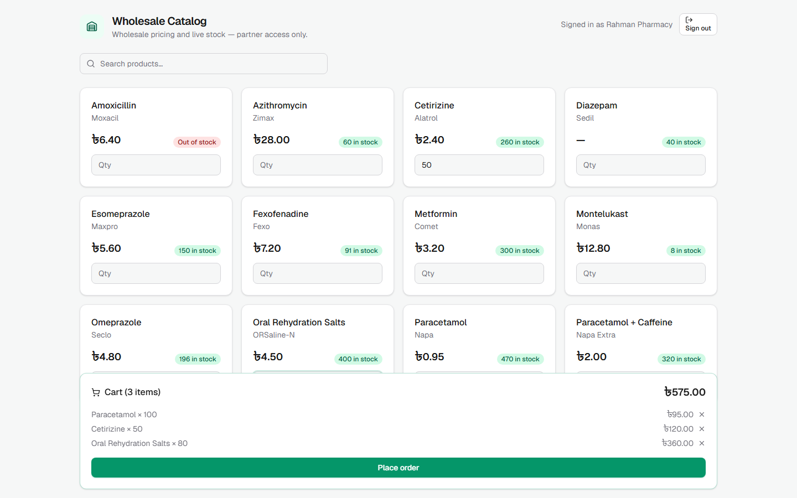
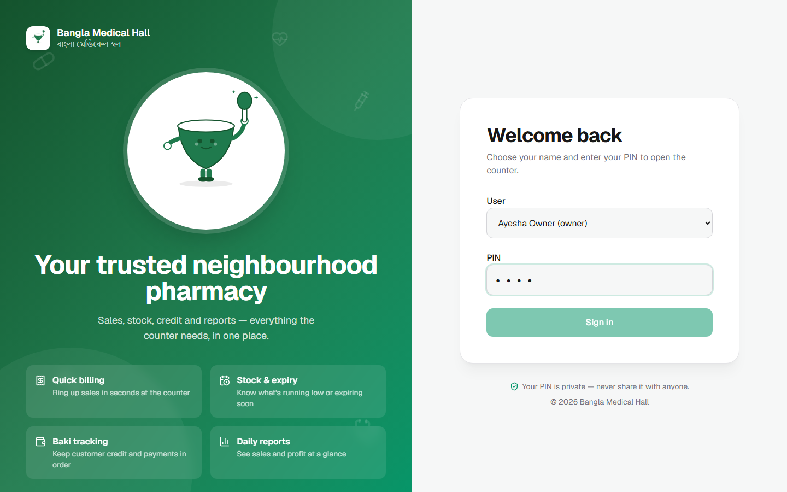
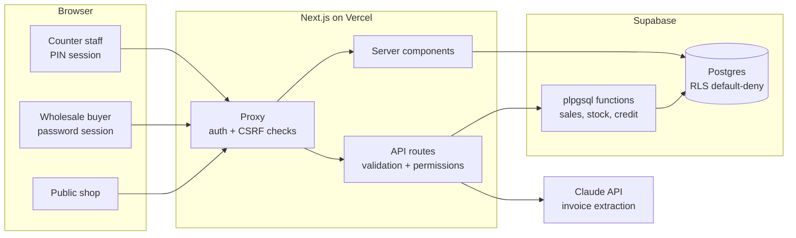

# Bangla Medical Hall

[](https://github.com/Samin-Zaman1/bangla-medical-hall/actions/workflows/ci.yml) [](https://github.com/Samin-Zaman1/bangla-medical-hall/actions/workflows/deploy.yml) [](https://github.com/Samin-Zaman1/bangla-medical-hall/actions/workflows/codeql.yml)

     

Point-of-sale and inventory system for a neighbourhood pharmacy in Bangladesh: billing, batch-level
stock with expiry tracking, customer credit (*baki*), supplier purchasing with AI invoice reading,
and a self-service portal for wholesale buyers.

Built end to end: product design, a Postgres data model with transactional business logic,
a Next.js app, ~300 automated tests, and a CI/CD pipeline that tests, migrates, deploys and
smoke-tests every release.



## The problem

Small pharmacies often run on paper: expiry dates are tracked by memory, customer credit lives in
a notebook, and the owner can't see what's selling without counting shelves. This app replaces
that with a system built around how the shop actually works — fast at the counter, strict about
stock and money.

## Features

- **Point of sale**: search-as-you-type with keyboard shortcuts, multi-item bills, discounts, cash change, bKash/Nagad/credit payments, printable receipts
- **Batch-level inventory**: stock tracked per batch so expiry and cost stay accurate; sales consume earliest-expiry stock first (FEFO); low-stock and expiring-soon alerts
- **Credit (baki)**: owner-approved credit sales, running customer balances, repayments
- **Purchasing**: supplier catalogues, purchase orders, stock-in on delivery
- **AI invoice extraction**: photograph a supplier invoice, Claude reads the line items, staff match and confirm them before any stock changes
- **Wholesaler portal**: wholesale buyers register, browse live stock at wholesale prices and order; staff confirm what to release
- **Role-based access**: PIN login for counter staff with an owner/staff permission matrix enforced on every API route
- **Controlled substances**: sales of controlled medicines are logged automatically

<table>
  <tr>
    <td></td>
    <td></td>
  </tr>
  <tr>
    <td></td>
    <td></td>
  </tr>
</table>

## Architecture



Key decisions:

- **Money and stock logic lives in Postgres functions, not in the app.** A sale locks the batches
  it draws from, consumes them earliest-expiry first, writes the sale, line items and stock
  movements, and updates the customer's credit, all in one transaction. Two tills can't oversell
  the same stock, and a failure halfway leaves nothing behind. Prices always come from the
  database, never from the client.
- **Defence in depth.** The proxy rejects cross-site writes and unauthenticated requests; every
  route re-checks the session and permission; every table has row level security, so the public
  Supabase key can read nothing.
- **Human review before AI writes data.** Extracted invoice lines land as a draft; model output is
  treated as untrusted input.
- **Supabase over HTTPS.** The shop's network blocks direct Postgres ports, so all data access
  goes through the Supabase client on port 443 (see `PROJECT_SPEC.md`).

## Engineering & quality

| Layer | Tool | Tests | What it proves |
| --- | --- | --- | --- |
| Unit | Vitest | 171 | Permission matrix, session tokens, proxy rules, API validation and error → HTTP status mapping |
| Component | Testing Library | 17 | Till behaviour: cart maths, stock limits, discount/credit rules, double-submit protection |
| Database | PGlite | 62 | Every migration applied to an in-process Postgres; sales, stock, credit and order functions exercised for real, including rollbacks, branch isolation and RLS |
| End to end | Playwright | 44 + 5 smoke | Real browser → real app → real Supabase in Docker: selling, credit, stock, wholesale ordering, role boundaries over HTTP, accessibility (axe) |

**CI/CD** ([docs/CI-CD.md](docs/CI-CD.md)) — every pull request runs lint, typecheck, all test
layers and the browser suite against a production build, plus CodeQL and a Vercel preview. Merging
to `main` migrates the database, deploys, smoke-tests the live site and rolls back automatically
if the smoke tests fail. A nightly run repeats the E2E suite on Chromium, Firefox and WebKit.

**Bugs the tests caught** — writing the suite surfaced real defects, now fixed:

- The wholesaler table had no row level security, so the *public* anon key could read account
  emails and password hashes. Fixed in migration 015, with a test that every table is locked down.
- Wholesalers never saw their order confirmation: it rendered inside the cart, which emptied on success.
- 32 form labels weren't linked to their inputs, breaking screen readers.

Open issues are tracked as expected-failure tests, so they're visible and can't silently regress
([list](docs/TESTING.md#known-issues-tracked-by-tests)).

## Running locally

Requires Node 24 and Docker (for the local database).

```bash
npm install
npm run db:local:start      # Supabase in Docker with every migration applied
cp .env.example .env.local  # fill in, or point at the local stack (see docs/TESTING.md)
npm run dev                 # http://localhost:3000 → /setup creates the owner account
```

```bash
npm test                    # unit + component + database tests (~10 s, no Docker needed)
npm run test:e2e            # Playwright end-to-end suite against the local stack
npm run test:e2e:ui         # interactive Playwright mode
npm run screenshots         # regenerate the images in this README
```

## Project structure

```
src/
├── app/
│   ├── (auth)/                # PIN login, first-run setup
│   ├── (dashboard)/           # Staff app: sales, inventory, purchasing, customers, …
│   ├── (public)/shop/         # Public storefront
│   ├── wholesaler/            # Wholesale buyer portal
│   └── api/                   # Route handlers (validation, permissions, RPC calls)
├── components/                # UI, grouped by feature
├── lib/                       # Auth, sessions, permissions, Supabase/Claude clients
└── proxy.ts                   # Edge auth + CSRF checks
supabase/migrations/           # Schema and plpgsql business logic, applied in order
tests/
├── unit/  components/  db/    # Vitest projects
└── e2e/                       # Playwright specs, fixtures, seed data
.github/workflows/             # CI, deploy, preview, nightly, CodeQL
docs/                          # Testing guide, CI/CD runbook
```

## Tech stack

**App:** Next.js 16 (App Router, server components), React 19, TypeScript, Tailwind CSS 4  
**Data:** Supabase (Postgres 17, PostgREST, Storage), plpgsql, Prisma (types)  
**AI:** Claude API (invoice extraction)  
**Quality:** Vitest, Testing Library, PGlite, Playwright, axe-core, ESLint, CodeQL  
**Delivery:** GitHub Actions, Vercel, Supabase CLI migrations, Dependabot

## License

MIT — see [LICENSE](LICENSE).
